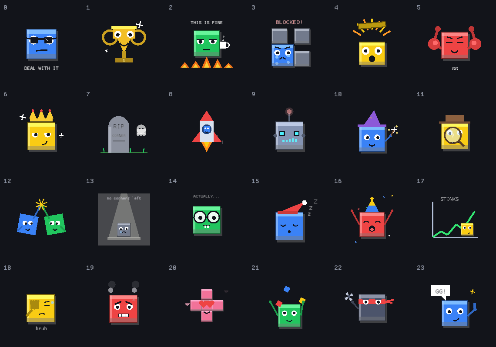

<div align="center">

```
    ██████╗ ██╗      ██████╗ ██╗  ██╗██╗   ██╗███████╗
    ██╔══██╗██║     ██╔═══██╗██║ ██╔╝██║   ██║██╔════╝
    ██████╔╝██║     ██║   ██║█████╔╝ ██║   ██║███████╗
    ██╔══██╗██║     ██║   ██║██╔═██╗ ██║   ██║╚════██║
    ██████╔╝███████╗╚██████╔╝██║  ██╗╚██████╔╝███████║
    ╚═════╝ ╚══════╝ ╚═════╝ ╚═╝  ╚═╝ ╚═════╝ ╚══════╝
```

🟦 🟨 🟥 🟩

**The classic four-player territory war — rebuilt in Rust, with a bandit-search AI, fireworks, cartoons, and chiptune sound.**


*by **Feng-Ting Liao***


</div>

---

## ⚡ Quick start

```sh
cargo run --release
```

Pick who's human and who's machine, set the **AI think-time dial** (0–5 seconds of allowed scheming per move), or hit **Watch 4 AI** and enjoy the show.

## 🎮 How it plays

Blokus rules, the official ones:

- **20 × 20** board, four colors, **21 polyomino pieces** each (89 squares of ambition).
- Your first piece covers your **corner**. After that, every piece must touch your own color **corner-to-corner — never edge-to-edge**.
- When nobody can move: **−1 point per unplaced square**, **+15** if you placed everything, **+5 more** if your last piece was the tiny monomino. Maximum flex.

| Control | Action |
|---|---|
| Click piece, then board | place (live legal/illegal preview + anchor hints) |
| `R` / right-click | rotate |
| `F` | flip |
| `Esc` | put the piece back |
| `Space` | pause the AI |
| `Up` / `Down` | AI think time |
| `M` | mute sound |

## 🎆 The show

Blokus is a game about ruining your friends' plans, and the game now celebrates accordingly:

- **Block a corner, get fireworks — and a cartoon.** Every move is audited for how many opponent growth-corners it stole. One or two blocked corners earns a burst on the spot; five or more launches a full rocket volley in the blocker's color, and every block pops a **cartoon taunt card** ("Red builds fences, not friendships."). Block nothing, get nothing. Earn your pyrotechnics.
- **Win, get a festival.** The victory screen is a continuous fireworks barrage biased to the winner's color, plus confetti, plus a **cartoon meme card** — caption from a 30-entry meme database, art from a 24-cartoon gallery, re-rolled every four seconds and personalized with the winner's name.
- **24 hand-coded cartoons.** No image files anywhere — every cartoon is animated vector art drawn live from Rust code: the crying blocked block, "this is fine" amid the flames, the RIP-corner tombstone, the lonely monomino, the stonks chart, the shuriken ninja... A random one greets you on the title screen too.
- **Chiptune soundtrack, synthesized at startup.** A built-in square/triangle/noise synthesizer renders seven original MIDI-style pieces — a laid-back menu theme, a victory fanfare, and a **five-track gameplay playlist that rotates through wildly different genres**: chip-pop, four-on-the-floor **club techno**, an E7-vamp **funk** groove with ghost-note bass, a walking-bass **lindy hop** swing number, and a drum-free **classical waltz** in 3/4. Plus a punchy **bang** every time corners get blocked (louder for bigger blocks). Zero audio assets shipped; it's all math. `M` mutes.
- **The craziness dial.** A front-page slider from *zen* (0%) to *LUDICROUS* (200%) scales every particle, rocket, confetto, and popup in the game. Your GPU, your rules.

<div align="center">

<br/><br/>

</div>

## 🧠 The AI

The old AI wandered around one edge cell and hoped. v2's AI evaluated every legal move with a heuristic. The current AI goes further — it *searches*:

1. **Enumerate** every legal move on the board (bitboards; a few milliseconds).
2. **Arm the bandit**: the top 40 candidates become arms of a **UCB1 multi-armed bandit** (regret-minimizing exploration), each seeded with a heuristic prior.
3. **Rollouts**: each pull plays the move, then simulates two full rounds of noisy-greedy play for all four colors, and scores the resulting position by placed-squares and corner-mobility differentials.
4. **Spend the budget**: the think-time dial (seconds) is honored to the millisecond — more time, more rollouts, deeper regret minimization. The search runs on a worker thread, so the UI never freezes; you get a progress bar while it plots.

Even at a modest 300 iterations it beats the previous heuristic AI **11 games out of 12** (avg score −11.6 vs −20.0). At dial 0 it falls back to the instant heuristic — still enough to shred the old C++ AI 20/20.

Want the math? The full algorithm and benchmark methodology are written up in the **[technical report](docs/tech-report.pdf)** ([LaTeX source](docs/tech-report.tex)) — bitboard formalization, the UCB1 formulation, Gumbel-softmax rollouts, and all the numbers.

```sh
cargo run --release --example selfplay   # strength + budget-compliance benchmark
cargo test                               # rules + AI + audio test suite (13 tests)
```

## 📜 The story

**v1 — the school project.** The original Blokus was written in C++ as a course project at **National Chiao Tung University** (since renamed National Yang Ming Chiao Tung University), by Feng-Ting Liao and ShengHsiung Hsieh — built on `graphics.h` and WinBGIm over DevC++, complete with BMP sprite files, a looping `.wav` soundtrack, and hand-rolled linked lists for everything. The surviving dev notes (`AI_idea.txt`) chronicle a month of AI brainstorming and end, honestly and eternally, with a linked-list bug and a crying `~~QQ`.

**The decade-long off-by-one.** v1's board was declared `Board[21][21]` — one row and one column more than the official game, quietly warping every match played on it. It survived every playtest. It outlived the compiler it was built with. It is fixed now. Rest in peace, row 21.

**v2 — the translation.** The entire game — engine, UI, AI — was translated from C++ to Rust by **Fable 5** (Claude, Anthropic's Mythos-class model). The rewrite swapped `graphics.h` for [macroquad](https://macroquad.rs), linked lists for bitboards, and the wandering-edge AI for a full-board evaluator — then a second pass upgraded that evaluator into the bandit search above, put the author's name in lights on the title screen, and added the fireworks. The `.wav` file did not make the jump. It was missed. 🎵

**v2.2 — the music came back.** Not as a file, but as an instrument: the game now carries its own tiny synthesizer and composes its soundtrack from note data at startup, the way v1's chunky `graphics.h` sprites were reborn as hand-coded vector cartoons. Nothing was restored; everything was reincarnated. And where v1 had one `.wav` on repeat, v2.2 runs a five-genre set — techno, funk, swing, a waltz — because a territory war deserves a house band.

## 🏗️ Under the hood

```
src/
├── pieces.rs   the 21 polyominoes + precomputed orientations (deduped rotations/flips)
├── game.rs     bitboard rules engine — legality, move generation, official scoring
├── ai.rs       greedy evaluator + UCB1 bandit search (mobility / denial / tempo)
├── memes.rs    the meme + taunt databases (30 memes, 13 taunts, {winner}-aware)
├── cartoons.rs 24 animated vector cartoons, drawn live from code
├── audio.rs    chiptune synthesizer — menu/win loops, a 5-genre gameplay playlist, the block bang
└── main.rs     macroquad UI — title, play, autoplay, particles, celebrations
```

Debug hooks for the curious: `BLOKUS_AUTO=<think-seconds>` boots straight into a 4-AI game, `BLOKUS_SHOT=shot.png` (with `BLOKUS_SHOT_FRAME=<n>`) captures a frame, `BLOKUS_MUTE=1` starts silent — it's how every screenshot in this README was taken.

<div align="center">

</div>

---

<div align="center">

**Created by Feng-Ting Liao** · v1 C++ original with ShengHsiung Hsieh · v2 Rust translation by Fable 5

*If you build your own game on top of this code, please reference this page.*

🟦 🟨 🟥 🟩

</div>
