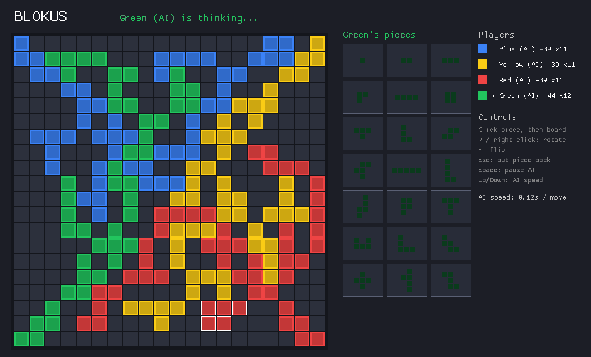

<div align="center">

```
    ██████╗ ██╗      ██████╗ ██╗  ██╗██╗   ██╗███████╗
    ██╔══██╗██║     ██╔═══██╗██║ ██╔╝██║   ██║██╔════╝
    ██████╔╝██║     ██║   ██║█████╔╝ ██║   ██║███████╗
    ██╔══██╗██║     ██║   ██║██╔═██╗ ██║   ██║╚════██║
    ██████╔╝███████╗╚██████╔╝██║  ██╗╚██████╔╝███████║
    ╚═════╝ ╚══════╝ ╚═════╝ ╚═╝  ╚═╝ ╚═════╝ ╚══════╝
```

🟦 🟨 🟥 🟩

**The classic four-player territory war — rebuilt in Rust, with an AI that actually fights back.**


*by **Feng-Ting Liao***



</div>

---

## ⚡ Quick start

```sh
cargo run --release
```

That's it. Pick who's human and who's machine, or hit **Watch 4 AI** and enjoy the show.

## 🎮 How it plays

Blokus rules, the official ones:

- **20 × 20** board, four colors, **21 polyomino pieces** each (89 squares of ambition).
- Your first piece covers your **corner**. After that, every piece must touch your own color **corner-to-corner — never edge-to-edge**.
- When nobody can move: **−1 point per unplaced square**, **+15** if you placed everything, **+5 more** if your last piece was the tiny monomino. Maximum flex.

| Control | Action |
|---|---|
| Click piece, then board | place (live legal/illegal preview) |
| `R` / right-click | rotate |
| `F` | flip |
| `Esc` | put the piece back |
| `Space` | pause the AI |
| `Up` / `Down` | AI speed |

## 🧠 The AI

The old AI wandered around one edge cell and hoped. This one enumerates **every legal move on the board** each turn, then scores each candidate like a Blokus player thinks:

- 🧱 **Play big early** — every square placed is a point saved.
- 📐 **Corners are oxygen** — maximize your own open corners (future mobility).
- 🚫 **Deny** — sit on the exact cells your opponents were planning to grow from.
- 🎯 **Race to the center** — get walled out of the middle in the opening and the game is already over.

All of it runs on bitboards (the whole board is 80 bytes per player), so a full-board analysis takes **~0.19 ms**. It never stalls, never cheats, and beats a random-move baseline **20 games out of 20** (average score −8.7 vs −37.3).

```sh
cargo run --release --example selfplay   # watch the benchmark yourself
cargo test                               # rules + AI test suite
```

## 📜 The story

**v1 — the school project.** The original Blokus was written in C++ as a course project at **National Chiao Tung University** (since renamed National Yang Ming Chiao Tung University), by Feng-Ting Liao and ShengHsiung Hsieh — built on `graphics.h` and WinBGIm over DevC++, complete with BMP sprite files, a looping `.wav` soundtrack, and hand-rolled linked lists for everything. The surviving dev notes (`AI_idea.txt`) chronicle a month of AI brainstorming and end, honestly and eternally, with a linked-list bug and a crying `~~QQ`.

**The decade-long off-by-one.** v1's board was declared `Board[21][21]` — one row and one column more than the official game, quietly warping every match played on it. It survived every playtest. It outlived the compiler it was built with. It is fixed now. Rest in peace, row 21.

**v2 — the translation.** The entire game — engine, UI, AI — was translated from C++ to Rust by **Fable 5** (Claude, Anthropic's Mythos-class model). The rewrite swapped `graphics.h` for [macroquad](https://macroquad.rs), linked lists for bitboards, and the wandering-edge AI for a full-board evaluator — roughly a **thousand-fold speedup** on the thinking end. The `.wav` file did not make the jump. It is missed. 🎵

## 🏗️ Under the hood

```
src/
├── pieces.rs   the 21 polyominoes + precomputed orientations (deduped rotations/flips)
├── game.rs     bitboard rules engine — legality, move generation, official scoring
├── ai.rs       full-move-enumeration evaluator (mobility / denial / tempo)
└── main.rs     macroquad UI — setup, play, autoplay, game-over screens
```

Debug hooks for the curious: `BLOKUS_AUTO=<sec/move>` boots straight into a 4-AI game, `BLOKUS_SHOT=shot.png` (with `BLOKUS_SHOT_FRAME=<n>`) captures a frame — it's how the screenshot above was taken.

---

<div align="center">

**Created by Feng-Ting Liao** · v1 C++ original with ShengHsiung Hsieh · v2 Rust translation by Fable 5

*If you build your own game on top of this code, please reference this page.*

🟦 🟨 🟥 🟩

</div>
